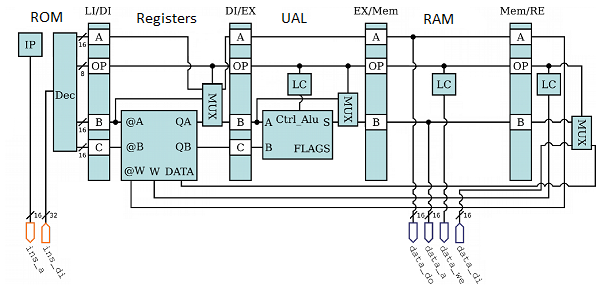

# C-to-ASM
C Langage to ASM Compiler (Yacc/Lex) and Processor (VHDL)

**Keyword**: Compiler C, Lex, Yacc, ASM, Xilinx ISE, VHDL, FPGA

**Description**: Write a compiler for language C and generate code ASM. Then, create a system on chip (FPGA) to execute the ASM code.

**Files**
- `C-Compiler/`
  - `C-Compiler/cly` compiler C to ASM
  - `C-Compiler/asmly` simulate execution ASM
  - `C-Compiler/asm2oply` generate OP code from ASM code
  - `C-Compiler/test` some C test, if you want to compile your proper C, you can take a look on it
- `ASM-Processor/`
  - lib: homepages.laas.fr/bmorgan/soc.tgz
  - `ASM-Processor/Configuration file` implementation configure file
  - `ASM-Processor/Entities files` main module `fpga.vhd` and sub-modules
  - `ASM-Processor/RAM files` file for init values of ROM 32 bits (`init32.hex`), RAM 16 bits (`init16.hex`)
  - `ASM-Processor/Test files` simulation of main module `fpgatest.vhd`, ans somes test bench for sub-modules

# Details
## C code
- variable type
  - int, const int
- Declaration & Affectation
- Expression E
  - int, id
  - ADD, MUL, SUB, DIV
  - EQU, INF, INFE, SUP, SUPE
- If & While loop
- Pointer & Malloc
  - type: \*int
  - value: &a
- Function
  - EBP, base pointer
  - allow recursive function
  - allow return value
- Pre/Post incrementation
  - value: i++
  - new loop: for(Affectation,E,id++)

### ASM & OP code
| Operation | Code | OP | | | | Description |
| --- | --- | --- | --- | --- | --- | --- |
| Addition | 0x01 | ADD | Ri | Rj | Rk | [Ri] ← [Rj] + [Rk] |
| Multiplication | 0x02 | MUL | Ri | Rj | Rk | [Ri] ← [Rj] * [Rk] |
| Subtraction  | 0x03 | SUB | Ri | Rj | Rk | [Ri] ← [Rj] - [Rk] |
| Division | 0x04 | DIV | Ri | Rj | Rk | [Ri] ← [Rj] / [Rk] |
| Copy | 0x05 | COP | Ri | Rj | | [Ri] ← [Rj] |
| Assignment | 0x06 | AFC | Ri | j_h | j_l | [Ri] ← j (16bits, j_h & j_l) |
| Load | 0x07 | LOAD | Rbp | j | Ri | @[[Rbp]+j] ← [Ri] |
| Save | 0x08 | STORE | Ri | Rbp | j | [Ri] → @[[Rbp]+j] |
| Equal | 0x09 | EQU | Ri | Rj | Rk | [Ri] ← 1 if [Rj]=[Rk], else 0 |
| Inferior | 0xA | INF | Ri | Rj | Rk | [Ri] ← 1 if [Rj]<[Rk], else 0 |
| Inferior equal | 0xB | INFE | Ri | Rj | Rk | [Ri] ← 1 if [Rj]<=[Rk], else 0 |
| Superior | 0xC | SUP | Ri | Rj | Rk | [Ri] ← 1 if [Rj]>[Rk], else 0 |
| Superior equal | 0xD | SUPE | Ri | Rj | Rk | [Ri] ← 1 if [Rj]>=[Rk], else 0 |
| Jumping | 0xE | JMP | @i_h | @i_l | | Jump to address @i (16bits) |
| Conditional Jumping | 0xF | JMPC | @i_h | @i_l | Ri | Jump to address @i (16bits) if Ri = 0 |
| Jumping to Register | 0x10 | JMPR | Ri | | | Jump to address @[Ri] |

## VHDL code
### Overview
- Conception of a microprocessor, type RISC, with 5 level pipe-line
- Input: `init32.hex`
  - Compatible avec les codes générés par Compilateur C
- RAM Memory: `init16.hex`
  - Si on veux initialisé le contenu du RAM
- Fréquences de fonctionnement: `92MHz` (requis 100 MHz, n'est pas satisfait à l'état actuelle du projet)
- Config projet  
  - Family: Spartan6
  - Device: XC6SLX16
  - Package: CSG324
  - Speed: -3
  - Synthesis Tool: XST (VHDL/Verilog)
  - Simulator: ISim (VHDL/Verilog)
  - Preferred Language: VHDL
  - VHDL Source Analysis Standard: VHDL-93

### Plan du chemin des données

| Instructions | Banc de registres(r) | UAL | Mémoires des données |Banc de registres(w) |
| --- | --- | --- | --- | --- |
| Pointeur d'instruction `ip`| |Logic Controller `lcual`| Logic Controller `lcmem` | Logic Controller `lc` |
| ROM 32 bits `bram32`| Registres `regs/read` | UAL `ual` | RAM `bram16` + VGA `vga_top`| Registres `regs/write` |
| Décodeur `decode`| Multiplexer `mux` | Multiplexer `muxual` | | Multiplexer `muxdata` |

\* `pipeline` Le passage entre les différents niveau de pipeline. synchrone, probager les valeurs OP, A, B, C à la sortie à chaque rising_edge(CLK), reset asynchrone avec signal NOP.

\*\* `ctlalea` Control aléa de donnée est mis en place pour gestion d'un write suivi d'un read sur le même registre; control aléa de branchement est pour gestion des jump.

### Explcation des unités
- IP
  - synchrone rising_edge(CLK)
  - pointeur d'instruction est un compteur, il pointe sur la prochaine ligne qu'on veut exécuté
  - Lors d'un aléa de donnée est détecter, IP arrête de compter pour laisser finir l'instruction écrire critique
- ROM
  - synchrone rising_edge(CLK)
  - contient les instructions que l'on veut exécuter
- Décode
  - combinatoire
  - Décodeur prend 32 bits à l'entrée et les séparent, selon OP, dans signaux A, B et C de 16 bits
- Registres
  - synchrone failling_edge(CLK)
    - pour garandir chaque pipeline se fait dans 1 CLK période
  - 32 registres de 16 bits synchrone
  - l'écriture et la lecture simultané est possible, considéré comme d'abord fait l'écriture
- UAL
  - combinatoire
  - permet de faire ADD, MUL, SUB, (DIV non implémenté)
- RAM
  - synchrone rising_edge(CLK)
  - plage 0x0000 - 0x3FFFF
- VGA
  - synchrone rising_edge(CLK)
  - plage 0x4000 - 0x7FFF
- LC logic controller
  - combinatoire
  - Il s'agit de détecter la présence d'une action write (registres ou mémoires), ou de repéré le calcul arithmétique voulu (ual)
- Multiplexer
  - combinatoire
  - Ceci s'agit de la choix entre signal passé par module (par exemple UAL), ou la valeur probagé depuis le pipeline précédent

### Amélioration
- Fréquence de fonctionnement
  - trouvé la chemin critique du code, essayer d'améliorer la fréquence de fonctionnement
- VGA
  - à l'état actuelle, l'affichage à l'écran VGA ne fonctionne pas, il n'y a aucun signal à la sortie
- Détection Aléa
  - Manque de séparation de cas READ x r 0 / READ x r r / READ x 0 r, c-à-d la lecture se fait sur quelle registre
  - L'écriture est la lecture simultané est possible, donc on peut encore réduire le temps d'attente lors de la détection d'un aléa de donnée
- Les instructions non traité: EQU, INF, INFE, SUP, SUPE
  - Aélioration possible: dans UAL faire Rj-Rk, affecter dans Ri selon la règle suivant
    - EQU = Z
    - INF = N
    - INFE = N or Z
    - SUP = not(N or Z)
    - SUPE = not(N)
- L'accès mémoire avec connecteur de bus non traité
  - Normalement il faut un module au milieu (`cores/conbus1x4.v`) pour multiplexer l'accès mémoire, selon les différents adresse, on peut accéder à RAM, Core Vidéo vga, Périphériques et Timers. Mais pour l'instant on a brancher directement les sigaux de adresse, data in, data out, we à module RAM etc.
